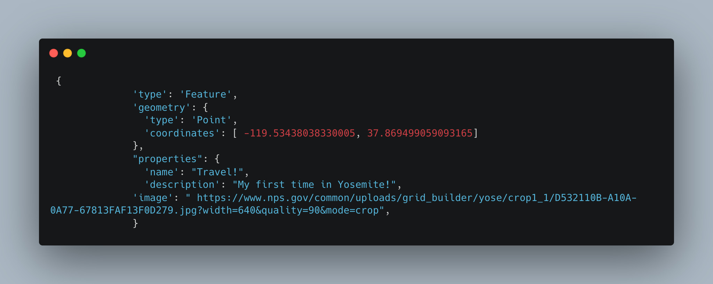

# MY FAVORITE LOCATIONS
)
## Overview

What does it do? Who would be interested in it?

[My wapplication](https://kevinshub-bubble.github.io/My-first-map/) is an extension of myself, it logs my interests, recreational activities, and duties as a student athlete who enjoys serving his community. It's an autobiography that welcomes people into my personal life. It's available for friends, family, and anyone who wishes to know more about my life during high school.

Heres a demo:

The interactive service on my website consists of a large map wherein active users can scroll through and click on three of my major interests thrughout highschool. The red pins mark three locations that signify three of my main interests throughout high school and their literal locations.

## Code Spotlight
The Code Spotlight Award is determined by a codes overall value, difficulty, and user friendly display. The most deserving sector of code within my HTML file is... The coordinate plane! The coordinate plane contributes to the project greatly, without it, users wouldn't be able to visit the sites of my highschol career. The plane is the foundation for imagery, creativity, and imagination. It's difficulty requires a high retention rate which engages coders through critical thinking. Yet, its possible to overcome through a foundational understanding of wordly coordinates. For these reasons, the coordinate plane is the most deserving of a the Code Spotlight Award.

Check out the code:

_The code is awsome, check it out!_
## Technology

To make this code, I used the following tools!   
1. [Visual Studio Code](https://code.visualstudio.com/), for the coding software and publication.
2. [GitHub](https://github.com/), used for sharing my project with peers, storing its data, and collective work.
3. [carbon](https://carbon.now.sh), to download my most valuable code. Its great and convenient!
4. [Kevins Bubble](https://kevinshub-bubble.github.io/My-first-map/), finally my websites link helped me organize my work and ensure I was on time with work.

## Contributions
I advise any of my friends, family, or peers to visit my website and recommend me more locations you know are related to me! I am very welcoming of reviews, advice, and all forms of feedback. I encourage readers to try making a similar map with a README section! It's a great challenge with a high learning curve, but the final project makes it all worth it.